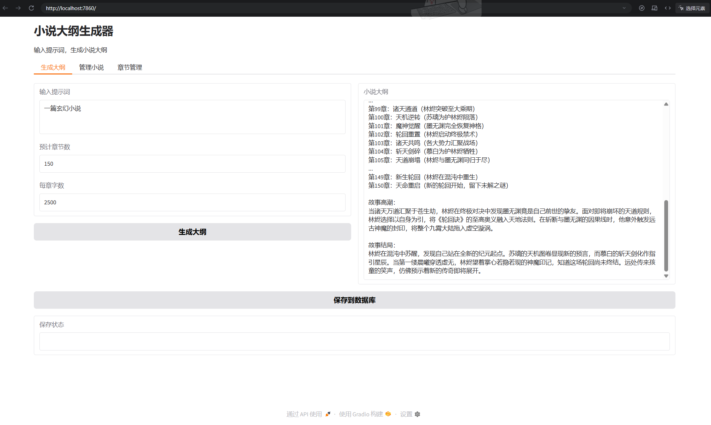

### 依旧每日保留节日

 * ━━━━━━神兽出没━━━━━━
 * 　　　┏┓　　　┏┓
 * 　　┏┛┻━━━┛┻┓
 * 　　┃　　　　　　　┃
 * 　　┃　　　━　　　┃
 * 　　┃　┳┛　┗┳　┃
 * 　　┃　　　　　　　┃
 * 　　┃　　　┻　　　┃
 * 　　┃　　　　　　　┃
 * 　　┗━┓　　　┏━┛
 * 　　　　┃　　　┃  神兽保佑
 * 　　　　┃　　　┃  代码无bug　　
 * 　　　　┃　　　┗━━━┓
 * 　　　　┃　　　　　　　┣┓
 * 　　　　┃　　　　　　　┏┛
 * 　　　　┗┓┓┏━┳┓┏┛
 * 　　　　　┃┫┫　┃┫┫
 * 　　　　　┗┻┛　┗┻┛
 * ━━━━━━感觉萌萌哒━━━━━━

---
# 好的接下来是正片
---
### 1.简介
如你所见这是一个3A大作 *~~用AI维护AI很合理的对吧:)~~* 总之，这个鬼东西算是勉强跑起来了
这个玩意给予ollama的后端服务，这意味着你需要下载一个[ollama Github](https://github.com/ollama/ollama/releases/tag/v0.17.6 "ollama下载链接github（建议）")或者[ollama官网](https://ollama.com/ "不建议，巨慢")

好的，详细的我会在部署那里讲，先接着介绍吧
如你所见，这是一个ai的长文写作，使用gradio的网页服务，从理论上来讲由于大纲和线索的存在，你几乎可以创建任意长度的文章，而不会出现逻辑链断裂，当然了，前提是你只能在开头指定好然后再开始生成。中途修改大纲是被允许的，但是可能会导致一些问题

这里我使用的是qwen3:8b的模型。显卡为单卡5070，生成速度还是比较可观的。具体的长文生成可能要等我慢慢测试了
### 2.部署
观察上面的链接，确保你已经安装好了ollama和python
接下来，你需要建立一个虚拟环境
```powershell
python -m venv .venv
```
然后进入它
```cmd
.\.venv\Scripts\activate
```
接下来安装依赖
```cmd
pip install -r requirements.txt
```
确保你的ollama已经在后台运行，它会出现在右下角的系统托盘，或者你选择手动启动（新建终端）
你可以访问[这个页面](http://127.0.0.1:11434/)，若观察到`Ollama is running`就已经启动成功
```cmd
ollama serve
```
然后回到你的虚拟环境
```cmd
python main.py
```
然后访问弹出的页面，你的服务已经跑起来了`^_^`


###### 运行截图：


